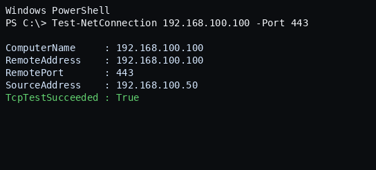
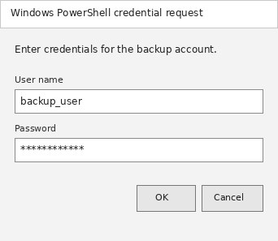
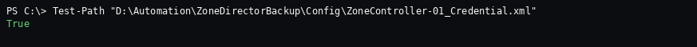
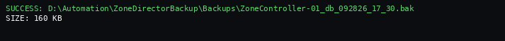

# ZoneDirector Backup Automation Guide

## Overview

This guide explains how to prepare and test automated Ruckus ZoneDirector configuration backups using PowerShell. The complete sanitized PowerShell script is maintained separately in the repository.

> **Security note:** All controller names, IP addresses, usernames, paths, filenames, and screenshots in this guide use dummy example values. Never upload production credentials or credential XML files to GitHub.

## Repository Files

- Documentation: `Documentation/ZoneDirector_Backup_Automation_Guide.md`
- PowerShell script: `../ZoneDirector_Backup_Sanitized.ps1`
- Screenshots: `Documentation/images/`

## Requirements

- Windows PowerShell 5.1
- `curl.exe`
- HTTPS connectivity to the ZoneDirector
- A dedicated backup user with the minimum required permissions
- A local backup directory

## 1. Create the Backup User

Create a dedicated user on the ZoneDirector for backup automation. Assign only the permissions required to download a configuration backup and use a strong password.

Before continuing, log in through the ZoneDirector web interface with this account and confirm that a backup can be downloaded manually.

## 2. Test HTTPS Connectivity

Open PowerShell and run:

```powershell
Test-NetConnection 192.168.100.100 -Port 443
```

Continue only when the result shows:

```text
TcpTestSucceeded : True
```



## 3. Create the Local Folder Structure

The following example creates separate folders for configuration, backups, and logs:

```powershell
$NewZDBase = "D:\Automation\ZoneDirectorBackup\Sample-Site"

New-Item -ItemType Directory -Path "$NewZDBase\Config" -Force | Out-Null
New-Item -ItemType Directory -Path "$NewZDBase\Backups" -Force | Out-Null
New-Item -ItemType Directory -Path "$NewZDBase\Logs" -Force | Out-Null
```

## 4. Create the Encrypted Credential File

Run the following command under the same Windows account that will run the scheduled task:

```powershell
Get-Credential | Export-Clixml "$NewZDBase\Config\ZoneController-01_Credential.xml"
```

Enter the dedicated backup username and password when prompted.



Confirm that the credential file exists:

```powershell
Test-Path "$NewZDBase\Config\ZoneController-01_Credential.xml"
```

The expected result is `True`.



> The encrypted credential file can normally be decrypted only by the same Windows user on the same computer. Do not commit this XML file to GitHub.

## 5. Configure the Script

Open `ZoneDirector_Backup_Sanitized.ps1` and update the example parameters for your environment:

```powershell
[string]$ControllerIP = '192.168.100.100'
[string]$ControllerName = 'ZoneController-01'
[string]$BasePath = 'D:\Automation\ZoneDirectorBackup\Sample-Site'
```

The full PowerShell code is intentionally not duplicated in this document. Use the separately maintained script in the parent folder:

[`ZoneDirector_Backup_Sanitized.ps1`](../ZoneDirector_Backup_Sanitized.ps1)

## 6. Test the Backup Manually

Run the script from an elevated PowerShell window:

```powershell
powershell.exe -NoProfile -ExecutionPolicy Bypass -File "D:\Automation\ZoneDirector_Backup_Sanitized.ps1"
```

A successful run should save a `.bak` file similar to:

```text
ZoneController-01_db_092826_17_30.bak
```



Verify that:

- The script reports `SUCCESS`.
- A new `.bak` file exists in the configured backup folder.
- The downloaded file is not an HTML login page.
- The log file records a successful backup.

## 7. Windows Task Scheduler

When creating the scheduled task:

- Select **Run whether user is logged on or not**.
- Enable **Run with highest privileges**.
- Use the same Windows account that created the credential XML file.
- Set **Program/script** to `powershell.exe`.
- Set **Add arguments** to:

```text
-NoProfile -ExecutionPolicy Bypass -File "D:\Automation\ZD_Backup_All_Sites_1.1.ps1"
```

- Set **Start in** to:

```text
D:\Automation
```

- Enable **Run task as soon as possible after a scheduled start is missed**.
- Select **Do not start a new instance** if the task is already running.

## Important Security Practices

- Never upload credential XML files, backup files, logs, passwords, production IP addresses, or real hostnames to a public repository.
- Keep real environment values only on the backup server.
- Add local sensitive folders and file types to `.gitignore` where applicable.
- Review screenshots before committing them to ensure they contain only dummy information.

